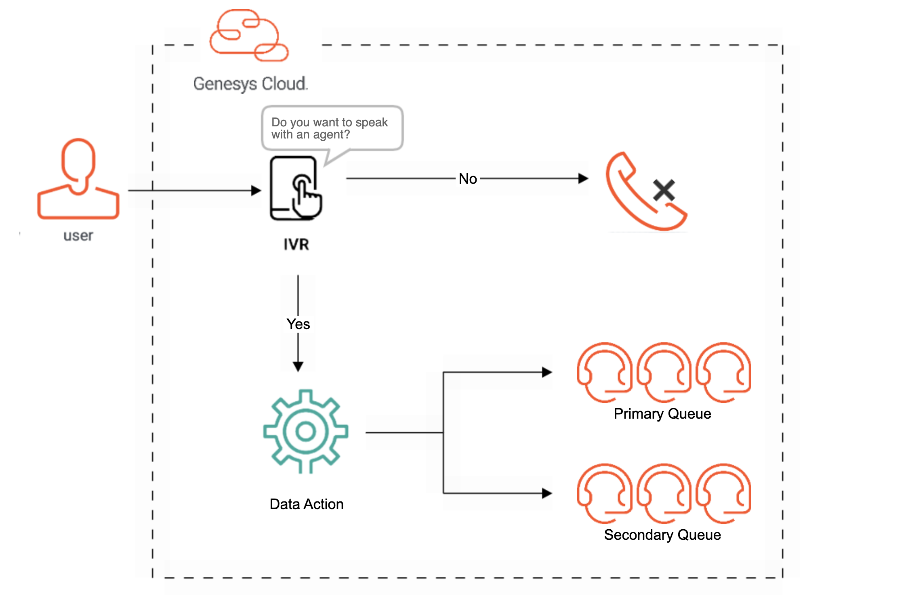

# Integrate a public API call into an Architect flow

> View the full [Integrate a public API call into an Architect flow](https://developer.mypurecloud.com/blueprints/) article on the Genesys Cloud Developer Center. 

This Genesys Cloud Developer Blueprint provides an example of how to integrate a public API call into an Architect flow to check if any agents are available on a given queue and make routing decisions based on the outcome.

